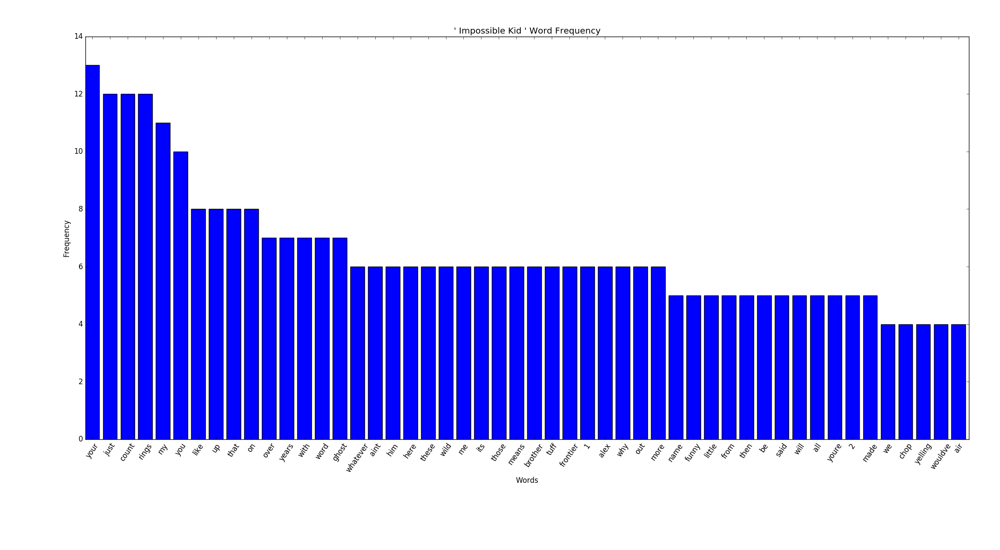
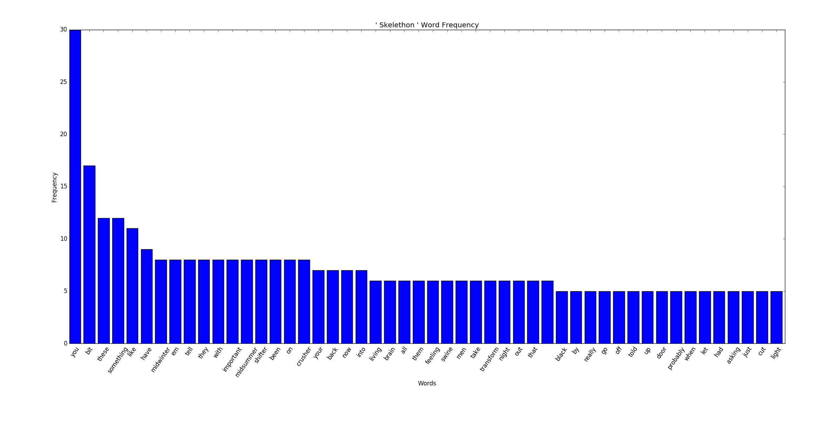
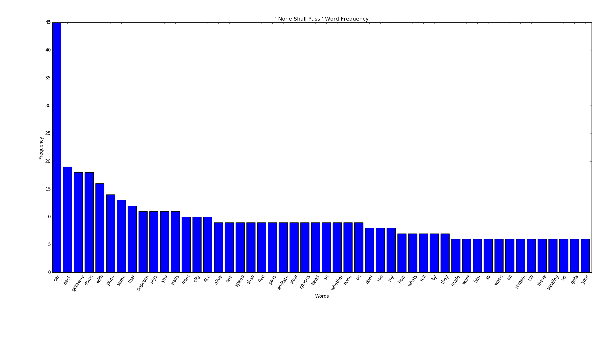
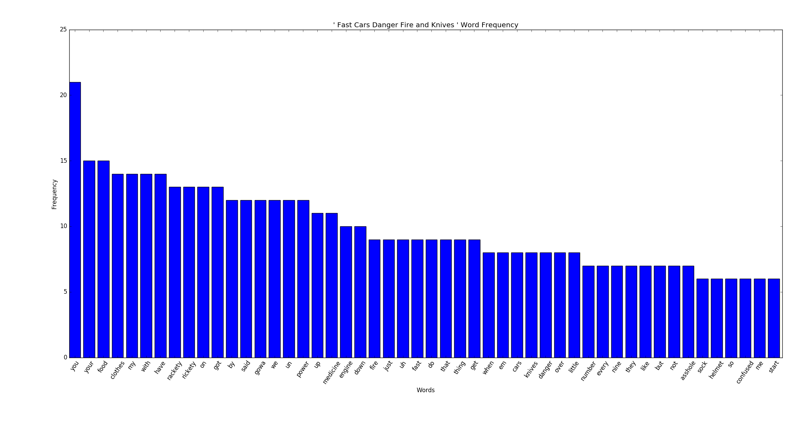
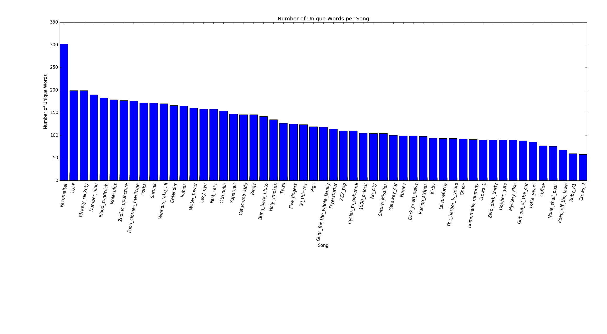
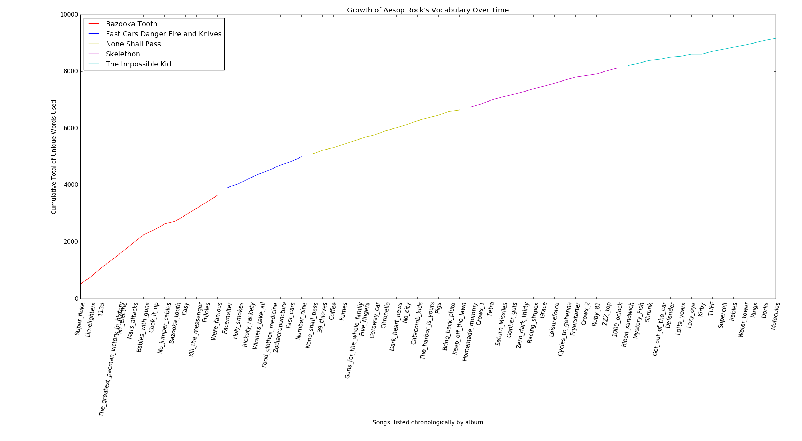
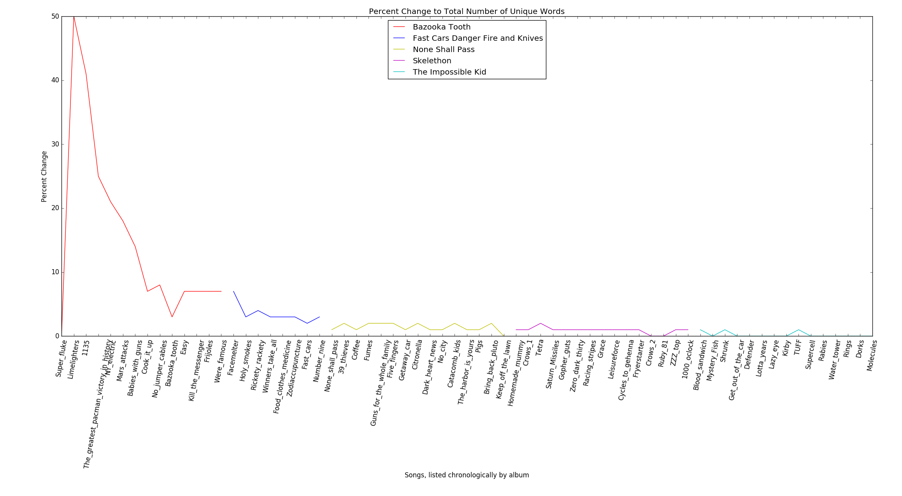

# Analysis of Aesop Rock Albums
After seeing another data project, displaying that one of my favorite artists,
Aesop Rock, has
[the largest vocabulary](https://pudding.cool/2017/02/vocabulary/)
among some of the biggest rappers, I decided to do some further exploring.  
There are three different aspects that I investigated here.  
1. The top 50, non-trivial, most used words per album
2. A list of Aesop's unique words -- words that were only used once over the four albums analyzed.
3. Every song (on four albums), ranked by number of unique words.

## Step 1: Cleaning the Data

All the lyrics were sourced from [Rap Genius](https://genius.com/artists/Aesop-rock)  
To eliminate words like "Word", "word", "word!" and "(word)" from being counted as four different words, 
the lyrics need to be stripped of special characters and put to lower case.  
Using regular expression, os and I/O tools in python, we can strip each line string, 
print the new line to a new file, and replace the original source with that new, cleaned up text file
```angular2html
import re
for song in album:
    # create new file '<song_name>_cleaned.txt' to hold new, stripped lyrics
    with open(str(song.name.split('.txt')[0] + '_cleaned.txt'), 'w') as f:
        for line in song:
            if line != "" and line != '\n' and '[' not in line and ']' not in line:
                line = line.strip('\n')
                line = re.sub('[\'\":*,.;()?!@#$\xe2\\x80\\x9c\x99]', '', line)
                line = re.sub('[-]', ' ', line)
                line = line.lower()
                f.write(line + '\n')
    # replace the original song file with the data in <song>_cleaned.txt
    f.close()
    os.system("mv lyrics/" + current_dir + "/" +
              str(song.name.split('.txt')[0].split(current_dir + "/")[1]) + "_cleaned.txt " + str(song.name))

```
Now, instead of the lyrics files containing text like this
>Free, forged in various pulp channels  
Even his prize horse rides a wolf into battle  
Even his blood and body couldn't pick him out a line up  
Or his name off the paper  
It's Aes pronounced "Why Us?!"

It's been replaced with text like this
>free forged in various pulp channels  
even his prize horse rides a wolf into battle  
even his blood and body couldnt pick him out a line up  
or his name off the paper  
its aes pronounced why us

## Step 2: Eliminate Trvial Words
I've also eliminated words I've deemed trivial for analysis. The ones I eliminated are the following
```angular2html
trivial_words = ['a', 'the', 'i', 'of', 'in', 'to', 'and', 'for', 'is',
                 'was', 'w', 'im', 'this', 'thats', 'it', 'are', 'or',
                 'no', 'at', ' ', 'he', 'his', 'she', 'her', 'if']
```
I debated on also removing words like "your", "you" or "on", but I decided to let it go for now. 
I may add those to the banned words also.  
After pairing the words with their count and sorting by most to least and taking the top 50,
I've plotted the following results

## Results
### The Impossible Kid

  
After this result, maybe I should revisit removing the word "your".
Knowing his songs though, I quickly noticed that the song *Rings*
is probably responsible for the top four words being in the position they are.
The chorus for Rings goes 
>shapes falling out of the fringe  
all heart though we wouldve made cowardly kings  
they will chop you down just to count your rings  
just to count your rings just to count your rings  
and there were colors pouring out of the fringe  
all heart though we wouldve made cowardly kings  
they will chop you down just to count your rings  
just to count your rings just to count your rings   


The choruses of his songs are often responsible for inflating the counts of certain words, which makes sense.
Something to look into in the future would be to identify the chorus and only give the words that 
are contained in the chorus a +1 score instead of, for example, what would be a 
+6 for the word "rings" for each chorus.  

### Skelethon

I was honestly surprised how often "you" was used in this album relative to the second most frequent word.
This album seems to have much sharper initial decline of word frequency than *The Impossible Kid*, but
a flatter tail. 

### None Shall Pass

It's amazing what one song in an album can do to sentiment analysis. The chorus of the song *Getaway Car* 
on this album is 
>in a getaway car geta getaway car  
in a getaway car car car car car  
in a getaway car geta getaway car  
in a getaway car car car car car car  


There are only a total of two occurences of the word "car" in all other songs on this album.
I should go back and modify how I score words in choruses.

### Fast Cars, Danger, Fire and Knives

One of Aesop's older (and arguably better) albums, we see a much wider distribution of frequencies.  
What I find most interesting about this result, is that the song *Food Clothes Medicine*,
Aesop uses the line "Food Clothes Medicine" with frequent repetition like so
>like food clothes medicine its yours  
its yours its yours its yours  
we rotate protocol on a ring finger neighbor to peruse gross negligence  
food clothes medicine  
martyrs leak faster if the carver tweaks the dagger 90 moves choked citizens  
food clothes medicine  
well yats a quick example accept as commitments castle cool dope excellent  
food clothes medicine

So it's strange that "food" and "clothes" are much higher up the list than "medicine". 


## Songs Ranked by Uniqueness


One of the things I like most about Aesop is his vocabulary and his word usage.
Before doing this project, I had maybe only heard the song *Facemelter* once or twice, but after seeing 
these results, I think I need to go back and listen to it again.  
After a few grep commands, I discovered that *Facemelter* has roughly 900 total words, 300 of which are unique.
Additionally, the song at the bottom of this list is only 43 lines long (roughly 290 words), and 
still has over 50 unique words.   
I expected to see a gradual decrease in unique word count like we do here, but I was very suprised by how far in the lead
*Facemelter* is.

## Distinct Words Across Four Albums
At the end of the analysis, I wanted to see which words, and how many of them, were only
used once across all 53 songs on these four albums. The results are sorted by longest words first.  
Amazingly, there are a total of 6,721 unique words.
>disproportionate  
excommunication  
unsubstantiated  
dispassionately  
disillusionment  
troubleshooting  
frankensteined  
predictability  
contemporaries  
aforementioned  
foreshortening  
rehabilitation  
sentimentalize  
misadventures  
preservatives  
progressively  
impersonating  
insubordinate  
perpendicular  
commiserating  
psychotropics  
uncomfortably  
quartermaster  
entertainment  
teleprompters  
compassionate  
appropriately  
unfortunately  
authoritative  
paraphernalia  
quote/unquote  
communication  
motherfucking  
indiscernible  
unsustainable  
schadenfreude  
relinquishing  
romanticizing  
disconnection  
independently  
underwhelming  
trillionaires  
understanding  
imperfections  
alphanumerics  
domestication  
acquaintances  
backdrafting  
checkerboard  
orchestrated  
codefendants  
tempermental  
hydrogenated  
concurrently  
successfully  
inaccessible  
unfulfilling  
emphatically  
insufferable  
accidentally  
disappearing  
percussionll  
exterminated  
fingerprints  
disassembled  
bloodletting  
communicator  
disenchanted  
superstition  
milquestoast  
pyrotechnics  
inhospitable  
mysteriously  
contaminated  
leisureforce  
relationship  
arpeggiators  
particularly  
pleasantries  
skullduggery  
sovereigntys  
subsequently  
disturbingly  
barbiturates  
opportunitys  
horizontally  
teleprompter  
gruesomeness  
entertaining  
interactions  
dependencies  
unremembered  
indisputable  
subservience  
photographic  
undesirables  
refrigerator  
inadequacies  
brotherhoods  
medicinehere  
coincidental  
conditioning  
respectively  
pennsylvania  
entertainers  
paratroopers  
bloodthirsty  
mockingbirds  
organization  
administered  
fieldstealth  
governmental  
rattlesnakes  
motherfucker  
chowderheads  
terraforming  
periodically  
troubleshoot  
distractions  
insecurities  
lifelessness  
additionally  
preservation  
echolocation  
carnivourous  
ungovernable  
speakerphone  
embarrassing  
overshadowed  
ricocheting  
destructing  
brandishing  
motherboard  
devastating  
ritualistic  
brotherhood  
distracting  
technically  
sequestered  
mantlepiece  
undeserving  
technicolor  
unexplained  
misanthrope  
absolvement  
butterknife  
dissipating  
understated  
reciprocity  
splintering  
diamondback  
regenerated  
antiquating  
consecutive  
synthesized  
territorial  
submarining  
sermonizing  
encouraging  
exaggerated  
playgrounds  
beatlemania  
disposition  
maintenance  
forevermore  
malpractice  
clusterfuck  
quarantined  
camaraderie  
competition  
suffocating  
surrounding  
practically  
multiplying  
ruminations  
neighboring  
electricity  
governments  
matchmakers  
drastically  
whirlybirds  
smithereens  
pirouetting  
masterpiece  
corinthians  
redenbacher  
collectible  
commiserate  
rehydrating  
tackleberry  
apparitions  
silhouetted  
arrangement  
participate  
hideoussilk  
malfunction  
powdertight  
interesting  
percentages  
restoration  
retardation  
credibility  
unappealing  
represented  
sensibility  
unimpressed  
sarcophagus  
fashionably  
interrogate  
bloodsucker  
botanically  
coordinates  
traditional  
fornicating  
therapeutic  
perspective  
curmudgeons  
righteously  
commitments  
auditioning  
exceedingly  
immediately  
portraiture  
unforgiving  
questioning  
information  
politicians  
accordingly  
differences  
impregnable  
investigate  
crestfallen  
alternative  
burgerville  
consistency  
documenting  
romanticize  
voluntarily  
effectively  
suckerproof  
revolutions  
deteriorate  
scholomance  
comfortably  
beautifully  
braggadocio  
breadcrumbs  
beautifying  
synthesizer  
appointment  
appropriate  
obsessively  
mentholated  
compliments  
disobedient  
christening  
materialize  
bittersweet  
misconstrue  
berserkers  
chameleons  
provisions  
resurfaced  
supposedly  
simulating  
barbershop  
threatened  
aggravated  
taxidermyd  
broomstick  
sanctioned  
manifestly  
mastermind  
scientific  
scissoring  
chandelier  
forgetting  
asymmetric  
vegetables  
liberating  
portcullis  
disappears  
mayonnaise  
motordrome  
vermillion  
changeling  
separating  
undetected  
previously  
buttermilk  
nauseating  
intimately  
galvanized  
supporting  
innovation  
petitioned  
incredible  
compliance  
horrendous  
outrageous  
accustomed  
smothering  
disavowing  
telecaster  
terrifying  
harnessing  
reconvened  
contraband  
recognized  
sanitizers  
florescent  
blitzkrieg  
relentless  
vaudeville  
collateral  
personally  
sweateroff  
silouettes  
translates  
fashioning  
silhouette  
good/young  
fluttering  
excavation  
scratching  
scientists  
peppercorn  
boisterous  
mystifying  
controller  
admittedly  
flashlight  
addressing  
collective  
homecoming  
celebrated  
underworld  
extraction  
accumulate  
mothballed  
caballeros  
rattletrap  
conviction  
inadequate  
chupacabra  
cinderella  
charitable  
compulsion  
granddaddy  
strawberry  
fabricated  
transcribe  
megaphones  
somethings  
cutthroats  
enthusiasm  
euthanasia  
centerfold  
impurities  
accomplish  
mothership  
nanopolice  
conference  
marionette  
preference  
huntington  
depressing  
witchcraft  
deficiency  
department  
attraction  
constantly  
medication  
antiquated  
gluttonous  
recreation  
disrespect  
convenient  
culminates  
metacarpal  
hellemundo  
colorfully  
passengers  
regretting  
mechanical  
diversions  
miscreants  
armageddon  
privileged  
corparates  
feverishly  
homeowners  
expendable  
injections  
carpenters  
milligrams  
especially  
underbelly  
maraschino  
exploiting  
crossbones  
documented  
citronella  
definition  
multiplies  
pentagrams  
infiltrate  
phenomenal  
sacrificed  
goosebumps  
laughingly  
pilgrimage  
corporates  
pineapples  
cigarettes  
artificial  
disfigured  
carnivores  
freakishly  
applicable  
impressive  
yesteryear  
immaculate  
pillowcase  
weathermen  
syncopated  
flashbacks  
kodachrome  
penmanship  
inoperable  
television  
adrenaline  
rubberneck  
irrational  
yesterdays  
legitimate  
remarkable  
retrospect  
toothbrush  
enthusiast  
ameliorate  
percentage  
assignment  
unsettling  
fragilitys  
hootenanny  
disgusting  
conception  
politician  
difference  
horizontal  
conditions  
terminally  
compassion  
determined  
fingertips  
widescreen  
ballentine  
completely  
alarmingly  
curricular  
negligence  
punishment  
painkiller  
disorderly  
enthralled  
coordinate  
treatments  
approaches  
commission  
appraisers  
cauterized  
facemelter  
apparently  
suspicious  
references  
ultimately  
funnybumps  
individual  
subsequent  
monolithic  
everything  
sycophants  
everywhere  
pronounced  
allegiance  
experience  
generation  
literature  
mismatched  
refreshing  
cannonball  
diagnostic  
portamento  
trajectory  
quarantine  
absolutely  
dimensions  
unfeasible  
designated  
 

This is just the top 500. The full text file can be found [here](All_Unique_Words.txt)  
For future work, I'd like to change how I score word frequencies when they appear in the chorus of the song.
Additionally, I'd like to add more of his albums and see how the data changes. Specifically, it'd be interesting to see 
how many words get added to the distinct words list, and also which ones currently on, end up getting 
removed when adding more lyrics.

## Cumulative Unique Word Total Over Time
The last thing I wanted to see was the growth in unique word count over time. 
To do this, I needed to find each new word used while looking through the text of each song,
chronologically by album.  
```angular2html

def cumulative_unique_words():
    words_contributed_by_song = {} #key = (album name, song name) value = number of new words
    word_count = [] #grand list of all words never seen before
    for a, album in enumerate(all_albums):

        for song in album:
            song_name = song.name.split('/')[2].split('.txt')[0]
            song.seek(0)

            for line in song:
                line = line.split('\n')[0]
                line = line.split(" ")
                for word in line:
                    if word not in word_count:
                        word_count.append(word)
            words_contributed_by_song[(album_name_map(a), song_name)] = len(word_count)
    return words_contributed_by_song


def unique_words_per_song_cumulative():
    cumulative_word_frequency = cumulative_unique_words()

    x_pos = 0
    x = []
    y = []
    percent_changes = []
    album_break_points = []
    first = "Bazooka Tooth"
    pos = 0
    for k, v in sorted(cumulative_word_frequency.iteritems(), key=lambda k: cumulative_word_frequency[k[0]]):
        x.append(x_pos)
        y.append(v)
        # need to know where the albums change for color reference on plot
        if k[0] != first:
            album_break_points.append(x_pos)
            first = k[0]
        #also want to look at a plot of the percent change in total unique words
        percent_changes.append(100*(y[pos]-y[pos-1])/y[pos-1])
        pos+=1

        x_pos += 1
```


We can see the growth of his vocabulary with the progression of his career. 
Although I wonder if the plateau-ing isn't just due to the fact that it would
get increasingly harder to add new words to his music after already putting out so many lyrics.
I'd like to do this same graph but reverse the order that I collect new words in and see if there is the same effect.  
Taking a look at the percent change...

we can see clearer dips and spikes and can more clearly tell which particular songs 
had what type of effect on the number of unique words used.  
If I keep working on this project, just as a note to myself, I need to fix 
how words in the chorus are counted. I think that's having a large impact on my data,
not necessarily for the worse, but I'd like to see what happens if I change that.
